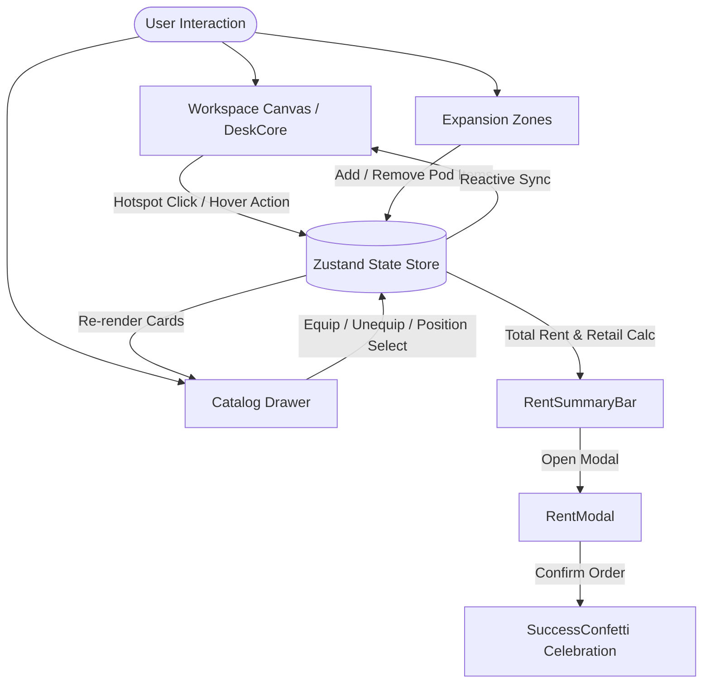

# 🛋️ Monis Rent — Interactive Workspace Designer (MVP)
*Built for the Desent Solutions Developer Challenge*

## 📝 Challenge Write-Up

### Approach
Instead of building a traditional, static product catalog, I wanted to create a highly visual, tactile experience that puts the user right at their future desk. I built an interactive, 3D-perspective "Workspace Stage" where users can drop items into place and immediately see their office come to life. The focus was on removing friction—interactions are instant, items have satisfying spring physics, and users can toggle between a flat layout and an immersive 3D viewport. The goal was to make renting office gear feel as fun and inspiring as playing a design simulator.

### Tech Choices
- **Next.js (App Router)**: For a robust, fast foundation with clean routing and project structure.
- **Zustand**: For lightning-fast global state management. This was crucial to ensure the canvas, catalog drawer, and live pricing ticker all stay perfectly in sync without prop-drilling or lag.
- **Tailwind CSS**: For rapid, consistent styling, custom UI tokens, and handling the complex 3D perspective transforms purely via utility classes.
- **Framer Motion**: To bring the desk to life with tactile spring-drop physics for equipment, while respecting accessibility (reduced motion).

### What I'd Improve With More Time
- **True 3D Models**: Integrate WebGL (React Three Fiber) to use actual 3D `.gltf` models instead of 2.5D CSS transforms, allowing users to rotate the furniture 360 degrees.
- **Freeform Drag-and-Drop**: Move away from fixed "slots" and allow users to freely drag, rotate, and snap items anywhere on the desk surface using a grid system.
- **Backend & Sharing**: Connect a database (like Supabase) to save user configurations so they can generate a unique URL to share their dream setup with friends before renting.
- **Auth & Dashboard**: Add user authentication to let digital nomads track their active rentals, extend their leases, or request support directly from a dashboard.

---

> **Welcome home to your dream workspace!**  
> An interactive, tactile office configuration web app inspired by the [monis.rent](https://monis.rent) rental subscription model. Instead of browsing a static, flat e-commerce table, you design your personal setup on an interactive desk stage with real-time monthly rental pricing, modular expansion pods, and zero-latency hardware switching.

---

## 🎯 What is Monis Rent MVP?

Building an ergonomic, productive workspace can be overwhelming and expensive. Buying high-end equipment like Herman Miller chairs, 5K studio displays, and motorized sit-stand desks requires thousands of dollars upfront.

**Monis Rent** flips this on its head:

1. **Interactive Visual Stage**: See exactly what your desk looks like before committing.
2. **Instant Subscription Pricing**: Watch your monthly rental rate adjust dynamically as you swap gear or extend your rental term (1 to 24 months with up to 20% discounts).
3. **Whole-Life Expansion Pods**: Need an espresso machine to start your morning? Or a commuter e-bike and surfboard? Add lifestyle and garage gear directly to your monthly bundle.

---

## ✨ Key Features & User Experience

### 🖥️ 1. Interactive Workspace Stage (`DeskCore`)

- **Realistic Depth & Finishes**: Switch between handcrafted Solid White Oak, Smoked Walnut, or Bamboo desk finishes with natural depth and woodgrain styling.
- **Smart Hotspots**: Pulsing indicators (`+ Add Left Monitor!`, `+ Place a Plant!`) invite exploration and automatically open the catalog drawer focused on the relevant category.
- **Spring Drop Physics**: Every item drops into place with a satisfying, tactile bounce using Framer Motion physics (`stiffness: 380, damping: 24`).
- **One-Click Presets**: Instantly load curated rigs like **Developer Pro**, **Nordic Minimalist**, or **Executive Lifestyle**.

### 🎛️ 2. Equipment Catalog Drawer (`CatalogDrawer`)

- **Hardware-Accelerated Slide**: Decoupled from heavy main-thread JS calculations; slides smoothly on the GPU compositor thread with pure CSS transforms and zero layout stutter.
- **Triple-Monitor Freedom**: Want three identical displays? You aren't restricted to three different brands! Monitor cards include individual position toggles (`Slot: [Left] [Center] [Right]`) and a 1-click **Triple (3x)** setup button.
- **1-Click Reversible Unequip**: Hovering over any equipped item turns the green checkmark into a rose-red **Unequip** button. Remove or swap items with a single tap.
- **Instant Search & Category Pills**: Filter across 20+ premium products (Herman Miller, Steelcase, Apple, Dell, Keychron, Breville, Cowboy, and more).

### ☕ 3. Modular Expansion Pods (`ZoneContainer`)

- **Coffee Station**: Breville Barista Express, Eureka Mignon Specialita grinder, and artisan ceramics.
- **Outdoor Mobility**: Cowboy Cruiser e-bike, custom foam surfboard, and weatherproof commuter backpacks.
- **Relax & Lounge**: Iconic Eames Lounge Chair, Fatboy original beanbags, and acoustic felt panels.
- **Garage & Studio**: Festool Systainer organizers, String Furniture modular wall shelves, and studio racks.

### 💳 4. Sticky Live Pricing & Checkout Celebration

- **Live Price Ticker (`RentSummaryBar`)**: Sticks smoothly to the screen bottom with real-time rolling digit animation whenever any gear is equipped.
- **Duration Discount Selector (`RentModal`)**: Choose between 1, 3, 6, 12, or 24-month terms with live discounts (up to 20% off).
- **Celebratory Confirmation (`SuccessConfetti`)**: Confirming your rental unleashes multi-cannon confetti bursts and presents a clean order summary.

---

## 🏗️ Technical Architecture & Stack



### Technology Highlights:

- **Framework**: [Next.js](https://nextjs.org/) 16 (App Router + Turbopack)
- **Runtime & Package Manager**: [Bun](https://bun.sh/)
- **State Management**: [Zustand](https://github.com/pmndrs/zustand) for predictable, zero-re-render client state
- **Styling**: [Tailwind CSS](https://tailwindcss.com/) with semantic tokens and custom modern palettes
- **Animation Strategy**:
  - **Panels & Drawers**: Pure GPU CSS transitions (`transform`, `opacity`) running on the compositor thread for 60/120 fps smoothness.
  - **In-Canvas Objects & Cards**: Framer Motion spring physics with `prefers-reduced-motion` a11y compliance.
- **Celebration Effects**: `canvas-confetti`

---

## 📁 Source Code Structure

| Directory / File                                                                                                                                 | Description                                                                              |
| :----------------------------------------------------------------------------------------------------------------------------------------------- | :--------------------------------------------------------------------------------------- |
| [`src/app/page.tsx`](file:///d:/Projects/Personal_Project/monis_rent_mvp/src/app/page.tsx)                                                       | Main page assembling Canvas, Expansion Zones, Catalog Drawer, and Sticky Checkout Bar    |
| [`src/components/canvas/DeskCore.tsx`](file:///d:/Projects/Personal_Project/monis_rent_mvp/src/components/canvas/DeskCore.tsx)                   | Interactive desk stage with 2.5D surface, customizable finish switcher, and slot anchors |
| [`src/components/canvas/ItemVisual.tsx`](file:///d:/Projects/Personal_Project/monis_rent_mvp/src/components/canvas/ItemVisual.tsx)               | Rendered physical equipment with spring entry and hover quick-actions (Swap / Remove)    |
| [`src/components/canvas/SlotHotspot.tsx`](file:///d:/Projects/Personal_Project/monis_rent_mvp/src/components/canvas/SlotHotspot.tsx)             | Pulsing dashed placeholder buttons that open targeted category drawers                   |
| [`src/components/catalog/CatalogDrawer.tsx`](file:///d:/Projects/Personal_Project/monis_rent_mvp/src/components/catalog/CatalogDrawer.tsx)       | Slide-over drawer with GPU compositor animation, Escape key closing, and search filter   |
| [`src/components/catalog/CatalogCard.tsx`](file:///d:/Projects/Personal_Project/monis_rent_mvp/src/components/catalog/CatalogCard.tsx)           | Equipment cards with 1-click unequip, multi-monitor position pills, and spec tags        |
| [`src/components/zones/ZoneContainer.tsx`](file:///d:/Projects/Personal_Project/monis_rent_mvp/src/components/zones/ZoneContainer.tsx)           | Expansion pods switcher (Coffee, Outdoor, Relax, Garage)                                 |
| [`src/components/checkout/RentSummaryBar.tsx`](file:///d:/Projects/Personal_Project/monis_rent_mvp/src/components/checkout/RentSummaryBar.tsx)   | Fixed bottom bar with animated rolling digit price counter and duration tabs             |
| [`src/components/checkout/RentModal.tsx`](file:///d:/Projects/Personal_Project/monis_rent_mvp/src/components/checkout/RentModal.tsx)             | Subscription checkout modal with itemized breakdown and discount calculator              |
| [`src/components/checkout/SuccessConfetti.tsx`](file:///d:/Projects/Personal_Project/monis_rent_mvp/src/components/checkout/SuccessConfetti.tsx) | Triple-cannon confetti celebration card                                                  |
| [`src/store/useWorkspaceStore.ts`](file:///d:/Projects/Personal_Project/monis_rent_mvp/src/store/useWorkspaceStore.ts)                           | Central reactive store for equipment slots, active zones, duration, and prices           |
| [`src/data/catalog.ts`](file:///d:/Projects/Personal_Project/monis_rent_mvp/src/data/catalog.ts)                                                 | Inventory dataset with specs, monthly rates, retail values, and presets                  |
| [`docs/`](file:///d:/Projects/Personal_Project/monis_rent_mvp/docs)                                                                              | Architecture specifications, UI/UX guidelines, and implementation tracker                |

---

## 🚀 Quickstart & Local Setup

### Prerequisites

- [Bun](https://bun.sh/) (recommended) or Node.js 18+

### 1. Clone & Install Dependencies

```bash
git clone https://github.com/your-username/monis_rent_mvp.git
cd monis_rent_mvp
bun install
```

### 2. Start the Development Server

```bash
bun run dev
```

Open [http://localhost:3000](http://localhost:3000) in your browser.

### 3. Production Build & Type Checking

```bash
bun run build
```

Builds an optimized static bundle with Turbopack and verifies all TypeScript types.

---

## ⌨️ Shortcuts & Accessibility

- **`Escape` Key**: Instantly closes the Catalog Drawer or Rent Confirmation Modal.
- **`prefers-reduced-motion`**: Automatically detected; disables heavy physics bounces and confetti particle bursts for users sensitive to motion.
- **Screen Reader Support**: All interactive buttons feature explicit `aria-label` tags, and inert panels use `aria-hidden`.

_Authored with care by the Technical Writer & Engineering Team._
