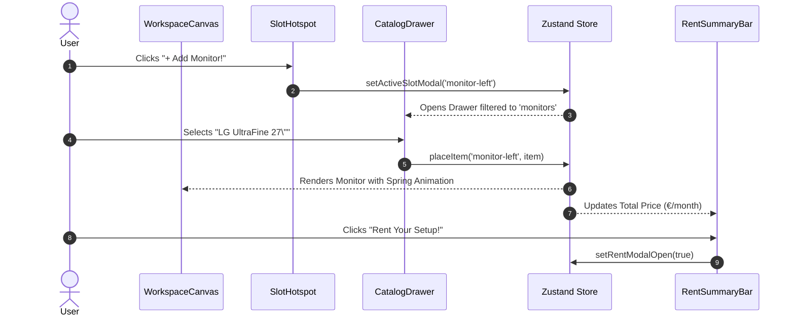

# System Architecture: Monis Rent Workspace Designer

**Author**: The Technical Writer & The Senior Backend Engineer  
**Status**: Approved  
**Version**: 1.0.0  

---

## 1. Overview & Core Philosophy

The **Monis Rent Workspace Designer** is an interactive, visual web application that allows remote workers and teams to configure their dream office setup and calculate their monthly subscription rental instantly.

The architecture emphasizes:
- **Instant reactivity**: Zero-latency UI updates when swapping or adding hardware via client-side state.
- **Predictable unidirectional data flow**: A centralized Zustand store drives all canvas elements and pricing calculations.
- **Reference-driven design**: UI and motion behaviors adhere strictly to project patterns in [animation_reference.md](file:///d:/Projects/Personal_Project/monis_rent_mvp/.knowledge/animation_reference.md).

---

## 2. Directory & File Structure

```
monis_rent_mvp/
├── .knowledge/                      # Global references & design knowledge
│   ├── animation_reference.md       # GSAP & spring animation patterns
│   └── current_task.md              # Project knowledge log
├── docs/                            # Core system documentation
│   ├── architecture.md              # System design & data flow (this file)
│   ├── ui-ux-guidelines.md          # Visual specs, Tailwind tokens, motion rules
│   └── implementation.md            # Actionable task list & bug tracker
├── public/                          # Static assets and product imagery
│   └── assets/
│       ├── chairs/
│       ├── desks/
│       ├── monitors/
│       └── zones/
├── src/
│   ├── app/                         # Next.js App Router
│   │   ├── favicon.ico
│   │   ├── globals.css              # Tailwind base, components, utilities
│   │   ├── layout.tsx               # Root layout with fonts & metadata
│   │   └── page.tsx                 # Main Workspace Designer page
│   ├── components/
│   │   ├── canvas/                  # Main interactive workspace stage
│   │   │   ├── WorkspaceCanvas.tsx  # Central stage hosting desk, 3D parallax, and slots
│   │   │   ├── DeskCore.tsx         # Desk surface, center finish selector, and anchor slots
│   │   │   ├── ItemVisual.tsx       # Rendered item with spring physics (hover tooltips removed)
│   │   │   ├── SlotHotspot.tsx      # "+ Add Monitor!", "+ Place Plant" hotspots
│   │   │   └── visuals/
│   │   │       └── ItemGraphic.tsx  # Dedicated bespoke visual artwork engine for all items
│   │   ├── catalog/                 # Equipment picker and category drawer
│   │   │   ├── CatalogDrawer.tsx    # Slide-over/top drawer with compositor CSS transitions
│   │   │   ├── CategoryTabs.tsx     # Chairs, Desks, Tech, Accessories tabs
│   │   │   └── CatalogCard.tsx      # Product card with illustrated preview & unequip
│   │   ├── zones/                   # Expansion zones (below main desk)
│   │   │   ├── ZoneContainer.tsx    # Horizontal switcher for expansion pods
│   │   │   └── ZonePod.tsx          # Modular pod container with thumbnail artwork
│   │   ├── checkout/                # Rental checkout and confirmation
│   │   │   ├── RentSummaryBar.tsx   # Sticky bottom bar with rolling digit ticker
│   │   │   ├── RentModal.tsx        # Term selector (1, 3, 6, 12, 24 mo) & breakdown
│   │   │   └── SuccessConfetti.tsx  # Celebratory rent confirmation with confetti
│   │   └── ui/                      # Primitive reusable UI elements (buttons, badges)
│   ├── data/
│   │   └── catalog.ts               # Seed data for furniture and electronics
│   ├── store/
│   │   └── useWorkspaceStore.ts     # Zustand store for workspace state & cart
│   └── types/
│       └── workspace.ts             # TypeScript definitions for items, slots, zones
├── bun.lockb                        # Bun lockfile
├── package.json                     # Project manifest and scripts
├── tailwind.config.ts               # Custom color tokens, shadows, animations
└── tsconfig.json                    # Strict TypeScript configuration
```

---

## 3. Data Architecture & Types

All workspace items and slots are strictly typed in `src/types/workspace.ts`.

### Core Data Models

```typescript
export type Category = 
  | 'chairs' 
  | 'desks' 
  | 'monitors' 
  | 'accessories' 
  | 'plants' 
  | 'coffee' 
  | 'outdoor' 
  | 'relax' 
  | 'garage';

export type SlotId = 
  | 'desk' 
  | 'chair' 
  | 'monitor-center' 
  | 'monitor-left' 
  | 'monitor-right' 
  | 'keyboard' 
  | 'mouse' 
  | 'desk-lamp' 
  | 'desk-plant'
  | 'coffee-station'
  | 'outdoor-gear'
  | 'relax-zone'
  | 'garage-space';

export interface CatalogItem {
  id: string;
  name: string;
  category: Category;
  slotCompatibility: SlotId[];
  monthlyPrice: number; // In EUR (€)
  dimensions?: string;
  badge?: string;       // e.g. "Popular", "Ergonomic", "Eco-friendly"
  imageUrl: string;
  description: string;
}

export interface PlacedItem {
  slotId: SlotId;
  item: CatalogItem;
  placedAt: number;     // Timestamp for sequencing
}

export type RentalDuration = 1 | 3 | 6 | 12 | 24; // Months
```

---

## 4. State Management (Zustand Store)

The store lives in `src/store/useWorkspaceStore.ts` and manages:

1. **Slots Map**: An index of `SlotId -> CatalogItem | null`.
2. **Active Category / Tab**: Tracks which catalog filter is currently open.
3. **Active Hotspot**: Tracks whether an "Add Item" modal or drawer is open for a specific slot.
4. **Rental Duration**: 1, 3, 6, 12, or 24 months, affecting dynamic discount tier calculation.
5. **Computed Totals**:
   - `totalMonthlyRent`: Sum of monthly rental fees for all active items minus duration discounts.
   - `totalItemCount`: Total count of active items in the workspace.

### Store Interface

```typescript
interface WorkspaceState {
  // State
  slots: Record<SlotId, CatalogItem | null>;
  selectedZone: 'desk' | 'coffee' | 'outdoor' | 'relax' | 'garage';
  activeSlotModal: SlotId | null;
  activeCategory: Category;
  rentalDuration: RentalDuration;
  isRentModalOpen: boolean;
  isOrderPlaced: boolean;

  // Actions
  placeItem: (slotId: SlotId, item: CatalogItem) => void;
  removeItem: (slotId: SlotId) => void;
  clearWorkspace: () => void;
  setActiveSlotModal: (slotId: SlotId | null) => void;
  setActiveCategory: (category: Category) => void;
  setSelectedZone: (zone: WorkspaceState['selectedZone']) => void;
  setRentalDuration: (duration: RentalDuration) => void;
  setRentModalOpen: (open: boolean) => void;
  placeOrder: () => void;
  resetOrder: () => void;
}
```

---

## 5. Component Interaction Flow



---

## 6. API & Integration Strategy

Because this is a high-speed interactive MVP frontend test:
- **Seed Data**: Fully bundled in `src/data/catalog.ts` with instant loading and zero network latency.
- **Mock Order Submission**: Handled via client action with realistic simulated network delay (600ms) for high-polish loading states before triggering the celebratory confirmation.
- **Extensibility**: Ready to connect to an external Next.js route handler (`/api/rent`) or a managed Postgres database (Supabase/Neon) if production persistence is required later.

---

## 7. Hybrid Motion Architecture (Compositor CSS + Spring Physics)

To deliver a high-performance experience that feels tactile without dropped frames on lower-end devices, the system uses a **decoupled hybrid animation strategy**:

```
┌─────────────────────────────────────────────────────────────┐
│                       HYBRID PIPELINE                       │
├──────────────────────────────┬──────────────────────────────┤
│  Layer 1: Layout Containers   │  Layer 2: Content & Objects  │
│  (GPU Compositor Thread)     │  (Main Thread / Spring Loop) │
├──────────────────────────────┼──────────────────────────────┤
│ • CatalogDrawer slide panel  │ • Canvas item drop springs   │
│ • Modal backdrop blur/fade   │ • Catalog card staggers      │
│ • Pure CSS transform/opacity │ • Price ticker flip counter  │
│ • 0 layout thrashing         │ • Canvas confetti cannons    │
└──────────────────────────────┴──────────────────────────────┘
```

1. **Persistent DOM Rendering for Heavy Panels**:
   Instead of unmounting drawers with `if (!isOpen) return null` (which triggers layout recalculations and animation snaps upon mount), container panels stay in the DOM with `translate-x-full` and `invisible delay-300`. Opening toggles `translate-x-0` using pure CSS transitions, running entirely on the GPU compositor thread at a solid 60/120 fps.
2. **Framer Motion for Object Physics**:
   Items dropped onto the desk utilize Framer Motion spring physics (`stiffness: 380, damping: 24, mass: 0.8`), giving each display, chair, or plant a satisfying bounce that mimics real physical placement.
3. **Accessibility Compliance**:
   All motion components respect the user's OS-level accessibility setting via `useReducedMotion()`. When active, spring physics collapse to simple opacity fades with zero jarring movement.

---

## 8. Multi-Slot Item Architecture & Setup Freedom

A primary UX innovation in the designer is **multi-slot item flexibility**, specifically tailored for monitors:

1. **Brand Freedom (Triple Setup Support)**:
   Power users frequently desire identical displays (e.g., Triple Apple Studio Displays or Triple Dell UltraSharps). The data model decouples item identity from slot occupancy:
   ```typescript
   // Independent slot assignment allowing identical catalog IDs across positions:
   slots: {
     'monitor-left':   CATALOG_ITEMS['monitor-apple-studio'],
     'monitor-center': CATALOG_ITEMS['monitor-apple-studio'],
     'monitor-right':  CATALOG_ITEMS['monitor-apple-studio'],
   }
   ```
2. **Context-Aware UI Controls**:
   - In **General Catalog Mode**, monitor cards render dedicated position toggles: `Slot: [Left] [Center] [Right]`, plus a 1-click **Triple (3x)** batch-action button.
   - In **Hotspot Mode** (e.g., clicking *Add Left Monitor* on the desk), cards adapt to show `+ Equip to Left` or `Equipped in Left`, cleanly differentiating between positions.
3. **Collisions & Pricing Safety**:
   The store's aggregation methods (`getBaseMonthlyTotal`, `getTotalRetailValue`, `getEquippedItemsCount`) iterate over slot entries (`Object.values(slots)`), ensuring multi-item setups calculate accurate totals, and `RentModal` keys each line item by `slotId` to prevent DOM key collisions.

---

## 9. In-Drawer Reversible State Management (Equip & Unequip)

To prevent visual layout shifts (mouse chasing) on the 3D canvas, items can be both equipped and unequipped directly from the catalog drawer without navigating back to the canvas:
- **Immediate State Reflection**: Toggling an item updates the Zustand store instantly, which cascades to the desk canvas, sticky price ticker, and item counter in real time.
- **"Currently Equipped" Header Strip**: The drawer dynamically inserts a strip for the active slot showing what is currently equipped, with a 1-click unequip trash icon.
- **Micro-Interaction Affordance**: Hovering over an active `Equipped` button morphs the style from emerald checkmark to a rose-red `Unequip` action with a trash icon, making reversible actions clear and discoverable without requiring a hover overlay on the canvas itself.
